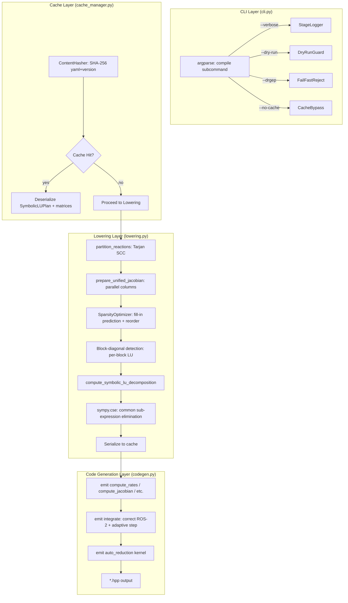
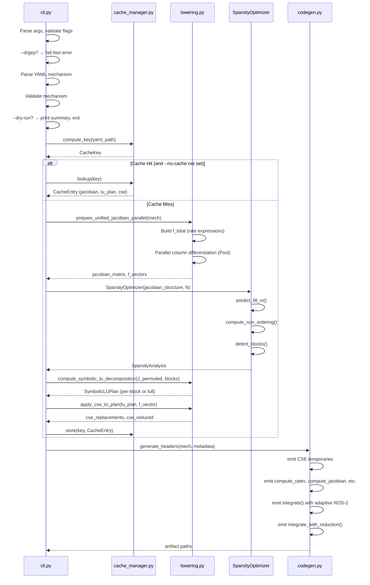

# Design Document: MKPP High-Impact Improvements

## Overview

This design specifies five incremental improvements to the Multiphase Kinetic PreProcessor (MKPP), an AOT compiler that transforms atmospheric chemistry YAML mechanisms into optimized Kokkos C++ Rosenbrock solver headers. The improvements address — in dependency order — codebase stability, numerical correctness, build performance, sparse algebra quality, and runtime adaptivity.

The enhanced pipeline is:

```
YAML → parser.py → model.py (MechanismDefinition)
     → cli.py (flags: --verbose, --dry-run, --no-cache)
     → cache_manager.py (SHA-256 lookup / store)
     → lowering.py (parallel Jacobian, CSE, sparsity optimizer, block partitioning)
     → codegen.py (correct ROS-2, adaptive step, auto-reduction kernels)
     → *.hpp (Kokkos C++ headers)
```

Each improvement is designed as an additive layer that preserves the existing CLI contract and deterministic output guarantee.

## Architecture



## Components and Interfaces

### Component 1: CLI Stabilization (`cli.py`)

**Purpose:** Remove all dead code, conflict markers, and duplications; add `--verbose`, `--dry-run`, `--drgep` (fail-fast), and `--no-cache` flags with structured error output.

**Interface Changes:**

```python
def run_compiler(
    mech_path: str,
    env_path: str,
    out_dir: str,
    strict: bool = False,
    emit_manifest: bool = True,
    enable_drgep: bool = False,
    drgep_threshold: float = 0.05,
    report: bool = False,
    lump_path: Optional[str] = None,
    verbose: bool = False,       # NEW
    dry_run: bool = False,       # NEW
    no_cache: bool = False,      # NEW
) -> None:
```

**Structured Error Format:**

```python
@dataclass
class CompilationError:
    stage: str           # "parsing", "validation", "lowering", "codegen"
    message: str
    reaction_index: Optional[int] = None
    species_name: Optional[str] = None
    yaml_location: Optional[str] = None  # "file.yaml:line:col"
```

**Behavioral Design:**
- `--drgep`: Raises `CompilationError(stage="validation", message="DRGEP not supported...")` immediately, before any SymPy work.
- `--verbose`: Emits `[stage_name] description` lines to stderr at: parsing, validation, partitioning, lowering, codegen.
- `--dry-run`: Runs through parsing + validation, prints a summary, then returns without calling `generate_headers()`.
- Deduplicate the import block (currently appears twice) and the lump_path logic (currently triplicated).
- Remove all `<<<<<<<`, `=======`, `>>>>>>>` markers.
- Remove reference to undefined `mech_reduced` variable.

**_Requirements: 1.1–1.8_**

### Component 2: Correct ROS-2 Solver with Adaptive Step Control (`codegen.py`)

**Purpose:** Fix the two backward-substitution bugs and add error estimation with adaptive step sizing to the generated `integrate()` function.

**Bug Analysis — K1 Backward Substitution:**

The current code in `codegen.py` lines 282–284:
```python
for i, expr_str in lu_plan.backward_sub_steps:
    s = re.sub(r'\by_(\d+)\b', r'y1_\1', s)   # BUG: uses previous loop's 's'
    s = re.sub(r'\bx_(\d+)\b', r'K1_\1', s)
```

The variable `s` is NOT initialized from `expr_str` — it still holds the last value from the forward substitution loop. Fix: add `s = expr_str` before the regex substitutions.

**Bug Analysis — K2 Backward Substitution:**

Same bug repeats for K2. Additionally, backward substitution steps are emitted in reverse order (from `lu_plan.backward_sub_steps` which iterates N-1 down to 0), meaning K2_6 is emitted first, K2_0 last. This is correct for the solve direction but the current code has a forward-reference issue where `K2_i` references a `K2_j` (j>i) that hasn't been declared yet. The root cause is the same: `s` is not reset from `expr_str`.

**Corrected Code Pattern:**

```python
for i, expr_str in lu_plan.backward_sub_steps:
    s = expr_str  # FIX: initialize from current step
    s = re.sub(r'\by_(\d+)\b', r'y1_\1', s)
    s = re.sub(r'\bx_(\d+)\b', r'K1_\1', s)
    f.write(f"          double K1_{i} = {s};\n")
```

**Adaptive Step Control Algorithm (ROS-2):**

The generated `integrate()` function will be wrapped in an adaptive loop:

```cpp
KOKKOS_INLINE_FUNCTION void integrate(double dt_total, StateView& state) const {
    const double safety = 0.9;
    const double max_growth = 5.0;
    const double min_shrink = 0.2;
    double t = 0.0;
    double dt = dt_total;  // initial trial step

    while (t < dt_total) {
        dt = Kokkos::min(dt, dt_total - t);

        // --- Stage 1: compute F1, form W, LU factorize, solve K1 ---
        // --- Stage 2: compute F2, solve K2 ---

        // Error estimation
        double err_norm = 0.0;
        for (int i = 0; i < NUM_SPECIES; ++i) {
            double sci = atol[i] + rtol[i] * Kokkos::abs(state(i));
            double err_i = Kokkos::abs(K1_i - K2_i) / sci;
            err_norm = Kokkos::max(err_norm, err_i);
        }

        // Step size control
        double factor = safety * Kokkos::pow(1.0 / Kokkos::max(err_norm, 1e-10), 0.5);
        factor = Kokkos::max(min_shrink, Kokkos::min(factor, max_growth));

        if (err_norm <= 1.0) {
            // Accept step
            for (int i = 0; i < NUM_SPECIES; ++i)
                state(i) += ros_M0 * K1_i + ros_M1 * K2_i;
            t += dt;
            dt *= factor;
        } else {
            // Reject step, retry with smaller dt
            dt *= factor;
        }
    }
}
```

**Tolerance Arrays:**

```cpp
static constexpr double atol[NUM_SPECIES] = { /* per-species absolute tolerance */ };
static constexpr double rtol[NUM_SPECIES] = { /* per-species relative tolerance */ };
```

Emitted from mechanism metadata or defaults (atol=1e-3 ppbv, rtol=1e-4).

**_Requirements: 2.1–2.7_**

### Component 3: Cache Manager and Parallel Lowering (`cache_manager.py`, `lowering.py`)

**Purpose:** Eliminate redundant SymPy computation via content-addressable caching; parallelize Jacobian column differentiation; apply CSE before code emission.

**New Module: `src/mkpp/cache_manager.py`**

```python
@dataclass
class CacheKey:
    yaml_hash: str       # SHA-256 of raw YAML file bytes
    mkpp_version: str    # from importlib.metadata

@dataclass
class CacheEntry:
    key: CacheKey
    jacobian_matrix: sp.Matrix
    lu_plan: SymbolicLUPlan
    species_map: List[str]
    cse_replacements: List[Tuple[sp.Symbol, sp.Expr]]
    cse_reduced: List[sp.Expr]

class CacheManager:
    def __init__(self, cache_dir: Path = Path(".mkpp_cache")):
        ...

    def compute_key(self, yaml_path: Path) -> CacheKey:
        """SHA-256 of file contents + MKPP version string."""
        ...

    def lookup(self, key: CacheKey) -> Optional[CacheEntry]:
        """Return deserialized entry or None."""
        ...

    def store(self, key: CacheKey, entry: CacheEntry) -> Path:
        """Serialize with pickle, return cache file path."""
        ...
```

**Cache File Layout:**
```
.mkpp_cache/
  <sha256_hex[:16]>.pkl     # pickled CacheEntry
```

**Parallel Jacobian Computation:**

The Jacobian is an N×N matrix where column j = ∂f/∂C_j. Each column is independent and can be computed in a separate process.

```python
def _compute_jacobian_column(args: Tuple[int, sp.Matrix, sp.Symbol]) -> sp.Matrix:
    """Worker function for multiprocessing — computes one Jacobian column."""
    j, f_total, c_j = args
    return f_total.diff(c_j)

def prepare_unified_jacobian_parallel(mech: MechanismDefinition) -> Dict[str, Any]:
    # ... build f_total as before ...

    with multiprocessing.Pool() as pool:
        columns = pool.map(
            _compute_jacobian_column,
            [(j, f_total, c_vector[j]) for j in range(N)]
        )

    jacobian_matrix = sp.Matrix.hstack(*[col.reshape(N, 1) for col in columns])
    # ... rest unchanged ...
```

**CSE Application:**

After the Jacobian and LU plan are computed, apply CSE to the full expression set:

```python
def apply_cse_to_plan(lu_plan: SymbolicLUPlan, f_vector: sp.Matrix) -> Tuple[List, List]:
    """Apply sympy.cse() to all expressions in the LU plan + rate vector."""
    all_exprs = [sp.sympify(e) for _, _, e in lu_plan.non_zero_jacobian]
    all_exprs += list(f_vector)

    replacements, reduced = sp.cse(all_exprs, optimizations='basic')
    return replacements, reduced
```

The Code_Generator emits CSE temporaries as:
```cpp
const double cse_0 = <expr>;
const double cse_1 = <expr>;
// ... then reference cse_N in subsequent expressions
```

**_Requirements: 3.1–3.8_**

### Component 4: Sparsity Optimizer with Block-Diagonal Partitioning (`lowering.py`)

**Purpose:** Predict fill-in before LU, apply bandwidth-minimizing reordering, detect independent blocks via Tarjan SCC on the Jacobian structure graph.

**New Class: `SparsityOptimizer`**

```python
@dataclass
class SparsityAnalysis:
    original_nnz: int
    fill_in_positions: Set[Tuple[int, int]]
    total_nnz_after_fill: int
    permutation: List[int]           # RCM/AMD reordering
    inverse_permutation: List[int]
    blocks: List[List[int]]          # list of species-index groups (SCCs)
    is_block_diagonal: bool

class SparsityOptimizer:
    def __init__(self, jacobian_structure: Set[Tuple[int, int]], n: int):
        self.structure = jacobian_structure
        self.n = n

    def predict_fill_in(self) -> Set[Tuple[int, int]]:
        """
        Graph-reachability fill-in prediction:
        For Doolittle LU, position (i,j) fills in if there exists k < min(i,j)
        such that both (i,k) and (k,j) are structurally non-zero (transitively).
        Uses iterative symbolic factorization on the structure graph.
        """
        ...

    def compute_rcm_ordering(self) -> List[int]:
        """
        Reverse Cuthill-McKee on the symmetrized structure graph.
        Returns permutation vector p where new_index = p[old_index].
        """
        G = nx.Graph()
        for i, j in self.structure:
            if i != j:
                G.add_edge(i, j)
        # NetworkX provides RCM directly
        import networkx as nx
        rcm = list(nx.utils.rcm.cuthill_mckee_ordering(G))
        rcm.reverse()  # Reverse for RCM
        return rcm

    def detect_blocks(self) -> List[List[int]]:
        """
        Run Tarjan SCC on the directed Jacobian structure graph.
        Each SCC with no cross-block edges becomes an independent block.
        """
        G = nx.DiGraph()
        for i, j in self.structure:
            if i != j:
                G.add_edge(i, j)
        sccs = list(nx.strongly_connected_components(G))
        # Sort for determinism
        return sorted([sorted(list(scc)) for scc in sccs], key=lambda b: b[0])

    def analyze(self) -> SparsityAnalysis:
        """Full sparsity analysis pipeline."""
        fill = self.predict_fill_in()
        perm = self.compute_rcm_ordering()
        blocks = self.detect_blocks()
        is_block_diag = self._check_block_independence(blocks)
        ...
```

**Fill-In Prediction Algorithm:**

```python
def predict_fill_in(self) -> Set[Tuple[int, int]]:
    """Symbolic Gaussian elimination on the structure graph (ILU(0) fill pattern)."""
    active = set(self.structure)
    active |= {(i, i) for i in range(self.n)}  # diagonal always present
    fill = set()

    for k in range(self.n):
        # Find all rows i > k where (i, k) is non-zero
        rows_with_k = [i for i in range(k+1, self.n) if (i, k) in active]
        # Find all columns j > k where (k, j) is non-zero
        cols_with_k = [j for j in range(k+1, self.n) if (k, j) in active]

        for i in rows_with_k:
            for j in cols_with_k:
                if (i, j) not in active:
                    fill.add((i, j))
                    active.add((i, j))

    return fill
```

**Block-Diagonal Code Generation:**

When blocks are independent, emit per-block solves:

```cpp
// Block 0: species [O3, O1D, O] (indices 0, 1, 2)
// W_block0, LU_block0, forward/backward sub for block0

// Block 1: species [NO, NO2, N2O5] (indices 3, 4, 5)
// W_block1, LU_block1, forward/backward sub for block1
```

This reduces register pressure from O(N²) to O(max_block_size²).

**_Requirements: 4.1–4.7_**

### Component 5: Rosenbrock Auto-Reduction (`codegen.py`, `lowering.py`)

**Purpose:** Emit runtime kernels that dynamically freeze near-equilibrium species, reducing the effective system size without recompiling.

**Generated Code Structure:**

```cpp
template <class StateView>
KOKKOS_INLINE_FUNCTION void integrate_with_reduction(
    double dt_total, StateView& state,
    double importance_threshold) const
{
    double importance[NUM_SPECIES];
    bool active[NUM_SPECIES];

    // Initialize all species as active
    for (int i = 0; i < NUM_SPECIES; ++i) active[i] = true;

    double t = 0.0, dt = dt_total;

    while (t < dt_total) {
        // 1. Evaluate importance for each species
        compute_rates(state, F_block);
        for (int i = 0; i < NUM_SPECIES; ++i) {
            double sci = atol[i] + rtol[i] * Kokkos::abs(state(i));
            importance[i] = Kokkos::abs(F_block(i)) / sci;
            active[i] = (importance[i] >= importance_threshold);
        }

        // 2. Form W with zeroed rows/cols for frozen species
        //    (leverages SymbolicLUPlan non-zero structure)
        for each (i,j) in non_zero_W:
            if (!active[i] || !active[j]) W_ij = (i==j) ? 1.0 : 0.0;
            else W_ij = <normal computation>;

        // 3. Sparse LU with conditional skips
        for each LU expression involving species i:
            if (!active[i]) skip;
            else compute normally;

        // 4. Solve K1, K2 with frozen species getting K=0
        for (int i = 0; i < NUM_SPECIES; ++i) {
            if (!active[i]) { K1_i = 0.0; K2_i = 0.0; continue; }
            // normal forward/backward sub
        }

        // 5. Error estimate + adaptive step (same as Component 2)
        // 6. Accept/reject step
    }
}
```

**Interaction with Sparsity Optimizer:**

The Auto_Reducer leverages the `SymbolicLUPlan.lu_expressions_ordered` list. Each entry `("L"|"U", i, j, expr)` is annotated at code-generation time with the set of species indices it depends on. At runtime, if any referenced species is frozen, that LU entry can be skipped.

**Species Dependency Annotation (compile-time, in `lowering.py`):**

```python
@dataclass
class AnnotatedLUExpression:
    kind: str           # "L" or "U"
    row: int
    col: int
    expr: str
    depends_on: Set[int]  # species indices whose activity affects this entry
```

**Re-activation Logic:**

A species is re-activated when `importance_i >= threshold` on the next evaluation. Since the Jacobian and W matrix are recomputed each step (because ROS-2 re-evaluates at each trial), re-activation is automatic — the species simply rejoins the active set.

**Accuracy Guarantee:**

The auto-reducer preserves accuracy because:
1. Frozen species have dC/dt ≈ 0, so their contribution to the Jacobian is negligible
2. When importance rises above threshold, they are immediately re-activated
3. The adaptive step controller (Component 2) ensures error remains within tolerances

**_Requirements: 5.1–5.7_**

## Data Models

### New Data Structures

```python
# In model.py

@dataclass
class CompilationError:
    """Structured error for CLI reporting."""
    stage: str
    message: str
    reaction_index: Optional[int] = None
    species_name: Optional[str] = None
    yaml_location: Optional[str] = None

@dataclass
class CacheKey:
    """Content-addressable cache identifier."""
    yaml_hash: str       # SHA-256 hex digest
    mkpp_version: str    # package version string

@dataclass
class CacheEntry:
    """Serializable intermediate compilation state."""
    key: CacheKey
    species_map: List[str]
    jacobian_matrix: Any           # sp.Matrix (pickled)
    adjoint_matrix: Any            # sp.Matrix (pickled)
    lu_plan: SymbolicLUPlan
    f_implicit: Any                # sp.Matrix (pickled)
    f_explicit: Any                # sp.Matrix (pickled)
    mass_projector: Any            # sp.Matrix (pickled)
    cse_replacements: Optional[List[Tuple[Any, Any]]] = None
    cse_reduced: Optional[List[Any]] = None

@dataclass
class SparsityAnalysis:
    """Result of sparsity optimization pass."""
    original_nnz: int
    fill_in_positions: Set[Tuple[int, int]]
    total_nnz_after_fill: int
    permutation: List[int]
    inverse_permutation: List[int]
    blocks: List[List[int]]
    is_block_diagonal: bool

@dataclass
class AnnotatedLUExpression:
    """LU expression with species-dependency metadata for auto-reduction."""
    kind: str              # "L" or "U"
    row: int
    col: int
    expr: str
    depends_on: Set[int]   # species indices affecting this entry

@dataclass
class SymbolicLUPlan:
    """Extended with sparsity and auto-reduction metadata."""
    num_species: int
    species_map: List[str]
    non_zero_jacobian: List[Tuple[int, int, str]]
    l_expressions: List[Tuple[int, int, str]]
    u_expressions: List[Tuple[int, int, str]]
    lu_expressions_ordered: List[Tuple[str, int, int, str]]
    forward_sub_steps: List[Tuple[int, str]]
    backward_sub_steps: List[Tuple[int, str]]
    # New fields:
    permutation: Optional[List[int]] = None
    blocks: Optional[List[List[int]]] = None
    annotated_expressions: Optional[List[AnnotatedLUExpression]] = None
    fill_in_count: int = 0
```

### Modified Existing Structures

The `MechanismDefinition` gains no new fields — all intermediate data flows through `mech.metadata` dict or function return values, preserving backward compatibility.

## Data Flow

### Full Pipeline Data Flow



## Algorithm Details

### Algorithm 1: Symbolic Fill-In Prediction

The fill-in prediction uses iterative elimination on the structure graph. For an N×N matrix with structure set S:

```
active = S ∪ {(i,i) : i ∈ 0..N-1}
fill = ∅

for k = 0 to N-1:
    rows_k = {i : i > k, (i,k) ∈ active}
    cols_k = {j : j > k, (k,j) ∈ active}
    for i ∈ rows_k:
        for j ∈ cols_k:
            if (i,j) ∉ active:
                fill = fill ∪ {(i,j)}
                active = active ∪ {(i,j)}
return fill
```

This is equivalent to computing the exact fill pattern of LU factorization with no pivoting (which is our case — symbolic Doolittle has fixed elimination order).

### Algorithm 2: RCM Bandwidth Reduction

1. Build the undirected adjacency graph G from the Jacobian structure (ignoring diagonal)
2. Apply Cuthill-McKee starting from a pseudo-peripheral node
3. Reverse the ordering (RCM)
4. Apply permutation to Jacobian: J_perm[p[i], p[j]] = J[i, j]
5. Store both `permutation` and `inverse_permutation` for code generation

### Algorithm 3: Block-Diagonal Detection

1. Build directed graph from Jacobian structure (non-zero off-diagonals = edges)
2. Run Tarjan SCC
3. Check if any cross-SCC edges exist after permutation
4. If blocks are independent (no cross-block non-zeros after fill-in), emit per-block solves
5. If cross-block coupling exists, fall back to single reordered solve

### Algorithm 4: Adaptive ROS-2 Step Control

```
Given: dt_total, state[N], atol[N], rtol[N]
Constants: γ = 1 + 1/√2, safety = 0.9, max_growth = 5.0, min_shrink = 0.2

t = 0, dt = dt_total
while t < dt_total:
    dt = min(dt, dt_total - t)
    F1 = f(state)
    W = (1/(γ*dt))*I - J(state)
    [L, U] = LU(W)
    K1 = solve(L, U, F1)

    Y_mid = state + (1/γ) * K1
    F2 = f(Y_mid)
    rhs2 = F2 + (-2/γ)/dt * K1
    K2 = solve(L, U, rhs2)

    // Error estimate
    err_norm = max_i |K1_i - K2_i| / (atol_i + rtol_i * |state_i|)

    factor = safety * (1/max(err_norm, 1e-10))^0.5
    factor = clamp(factor, min_shrink, max_growth)

    if err_norm ≤ 1.0:
        state += (3/(2γ)) * K1 + (1/(2γ)) * K2
        t += dt
    dt *= factor
```

### Algorithm 5: Runtime Auto-Reduction

```
Given: state[N], threshold, atol[N], rtol[N]

Each step:
    F = f(state)
    for i in 0..N-1:
        importance[i] = |F[i]| / (atol[i] + rtol[i] * |state[i]|)
        active[i] = (importance[i] >= threshold)

    // Build W with frozen species identity rows/cols
    for (i,j) in non_zero_W:
        if not active[i] or not active[j]:
            W[i][j] = (i == j) ? 1.0 : 0.0
        else:
            W[i][j] = normal_computation(i, j)

    // LU with conditional skip
    for each LU_expr in annotated_expressions:
        if any(not active[s] for s in LU_expr.depends_on):
            skip
        else:
            compute LU_expr

    // Solve with frozen species getting K=0
    for i in 0..N-1:
        if not active[i]: K1[i] = 0, K2[i] = 0
        else: normal forward/backward sub
```

## Correctness Properties

*A property is a characteristic or behavior that should hold true across all valid executions of a system — essentially, a formal statement about what the system should do. Properties serve as the bridge between human-readable specifications and machine-verifiable correctness guarantees.*

### Property Reflection

After prework analysis, the following redundancy was identified and resolved:
- 3.5 and 3.6 (parallel Jacobian determinism) are the same property — combined into one.
- 4.5 and 4.6 (block-diagonal solve equivalence) test the same invariant — combined.
- 5.3, 5.4, 5.5, 5.6 all test aspects of the auto-reduction active/frozen state machine — combined into two properties (freeze correctness and re-activation correctness).

### Property 1: Structured error messages contain required fields

*For any* invalid mechanism YAML (missing parameters, undefined species references, type mismatches), the `CompilationError` raised by the validation pipeline SHALL contain non-None values for `stage`, `message`, and at least one of `reaction_index` or `species_name`.

**Validates: Requirements 1.7**

### Property 2: Backward substitution variable initialization

*For any* SymbolicLUPlan with N ≥ 1 species and any sparsity pattern, the generated K1 backward-substitution code SHALL reference `y1_*` (forward-sub intermediates) and `U_*` (LU factors) variables — never stale values from a previous loop iteration.

**Validates: Requirements 2.1**

### Property 3: Stage 2 completeness

*For any* mechanism with N species, the generated integrate() function SHALL contain the complete sequence: F2 evaluation at intermediate state, rhs2 formation referencing K1, forward substitution for y2, and backward substitution for K2 in reverse index order.

**Validates: Requirements 2.2**

### Property 4: Tolerance array sizing

*For any* mechanism with N species, the generated header SHALL emit `atol[N]` and `rtol[N]` arrays with exactly N entries each.

**Validates: Requirements 2.6**

### Property 5: Cache round-trip consistency

*For any* valid `CacheEntry` containing a SymbolicLUPlan and SymPy matrices, serializing to disk with `CacheManager.store()` and then deserializing with `CacheManager.lookup()` SHALL produce an object that is structurally equal to the original (same species_map, same non_zero_jacobian entries, same LU expressions).

**Validates: Requirements 3.2**

### Property 6: Content hash determinism and sensitivity

*For any* two distinct YAML byte sequences `a` and `b` where `a ≠ b`, `compute_key(a).yaml_hash ≠ compute_key(b).yaml_hash`. Conversely, *for any* YAML byte sequence `x`, `compute_key(x) == compute_key(x)` (idempotent).

**Validates: Requirements 3.1**

### Property 7: Parallel Jacobian equivalence

*For any* mechanism with N species, the Jacobian matrix computed via parallel column differentiation SHALL be element-wise identical to the Jacobian computed sequentially (same SymPy expressions after simplification).

**Validates: Requirements 3.5, 3.6**

### Property 8: CSE semantic preservation

*For any* set of SymPy expressions, applying `sympy.cse()` and then substituting the replacements back into the reduced expressions SHALL yield expressions mathematically equivalent to the originals (verified by numerical evaluation at random points).

**Validates: Requirements 3.7**

### Property 9: CSE declaration ordering

*For any* set of CSE replacements emitted by the Code_Generator, each `cse_N` temporary SHALL be declared (emitted) before any line that references it.

**Validates: Requirements 3.8**

### Property 10: Fill-in prediction soundness

*For any* N×N sparse matrix with arbitrary non-zero pattern, the fill-in positions predicted by `SparsityOptimizer.predict_fill_in()` SHALL be a superset of the positions that become non-zero during actual Doolittle LU factorization.

**Validates: Requirements 4.1, 4.2**

### Property 11: RCM bandwidth reduction

*For any* sparse symmetric structure graph with N ≥ 2 nodes, the bandwidth of the RCM-permuted matrix SHALL be less than or equal to the bandwidth of the original matrix.

**Validates: Requirements 4.3**

### Property 12: Permuted solve equivalence

*For any* N×N non-singular matrix W and right-hand side vector b, solving the permuted system P·W·Pᵀ · (P·x) = P·b and then un-permuting SHALL yield the same solution vector x as solving the original system W·x = b (within floating-point tolerance).

**Validates: Requirements 4.4, 4.5, 4.6**

### Property 13: Sparsity optimizer determinism

*For any* Jacobian structure set S and matrix size N, invoking `SparsityOptimizer(S, N).analyze()` twice SHALL produce byte-identical `SparsityAnalysis` results (same permutation, same blocks, same fill-in set).

**Validates: Requirements 4.7**

### Property 14: Auto-reduction freeze correctness

*For any* mechanism state where species i has `importance_i < threshold`, the auto-reduced solver SHALL produce K1_i = 0 and K2_i = 0 for that species, leaving `state(i)` unchanged after the step.

**Validates: Requirements 5.3, 5.4**

### Property 15: Auto-reduction re-activation

*For any* species i that was frozen on step N but has `importance_i >= threshold` on step N+1, the solver SHALL include species i in the full implicit solve on step N+1 (active[i] = true, Jacobian row/col are non-zero if structurally present).

**Validates: Requirements 5.5, 5.6**

## Error Handling

### CLI Error Handling Strategy

| Error Type | Stage | Behavior |
|---|---|---|
| YAML parse error | parsing | Emit `CompilationError` with file location, exit 1 |
| Schema validation | validation | Emit `CompilationError` with reaction/species, exit 1 |
| DRGEP flag | validation | Immediate structured rejection, exit 1 |
| Singular pivot (LU) | lowering | Emit error with species name at pivot, exit 1 |
| Cache corruption | cache | Log warning to stderr, recompute (non-fatal) |
| Pickle version mismatch | cache | Invalidate entry, recompute (non-fatal) |
| multiprocessing error | lowering | Fall back to sequential, log warning |
| CSE timeout (>60s) | lowering | Skip CSE, log warning, proceed without optimization |

### Generated Code Error Handling

The generated C++ code handles errors through:
1. **Step rejection loop**: If error norm > 1.0, retry with smaller dt (up to max_retries = 100)
2. **Minimum dt guard**: If dt falls below `dt_min` (1e-15), accept anyway and log diagnostic
3. **NaN/Inf detection**: Check state values after each accepted step; if detected, restore last good state
4. **Non-negative guard**: Clamp state(i) to max(state(i), 0.0) after each accepted step (concentrations cannot be negative)

### Cache Error Recovery

```python
def lookup(self, key: CacheKey) -> Optional[CacheEntry]:
    path = self._key_to_path(key)
    if not path.exists():
        return None
    try:
        with open(path, 'rb') as f:
            entry = pickle.load(f)
        # Validate structure
        if not isinstance(entry, CacheEntry):
            path.unlink()
            return None
        return entry
    except (pickle.UnpicklingError, EOFError, AttributeError):
        # Corrupted cache file — remove and return miss
        path.unlink(missing_ok=True)
        return None
```

## Testing Strategy

### Unit Tests (pytest)

| Component | Tests | Focus |
|---|---|---|
| cli.py | Flag parsing, error format, dry-run behavior | Specific examples |
| cache_manager.py | Hash computation, store/load, corruption recovery | Edge cases |
| codegen.py | K1/K2 emission for small mechanisms (N=3,7) | Concrete output verification |
| SparsityOptimizer | Known matrices with hand-computed fill-in | Specific examples |
| Auto-reduction | Known importance vectors, expected active sets | State transitions |

### Property-Based Tests (Hypothesis)

The project will use [Hypothesis](https://hypothesis.readthedocs.io/) for property-based testing in Python.

**Configuration:** Each property test runs a minimum of 100 iterations.

**Tag format:** `# Feature: mkpp-high-impact-improvements, Property N: <title>`

| Property | Generator Strategy |
|---|---|
| P1: Structured errors | Generate invalid mechanisms (missing params, bad refs) |
| P2: Backward sub init | Generate random NxN Jacobians (N=2..12), compute LU plans |
| P3: Stage 2 completeness | Same as P2 |
| P4: Tolerance arrays | Generate mechanisms with N=1..20 species |
| P5: Cache round-trip | Generate random SymbolicLUPlans with varying sizes |
| P6: Hash determinism | Generate random bytes + version strings |
| P7: Parallel Jacobian | Generate small mechanisms (N=2..8) with random reactions |
| P8: CSE preservation | Generate random SymPy expression trees (depth 1-4) |
| P9: CSE ordering | Same as P8 |
| P10: Fill-in soundness | Generate random sparse patterns (N=3..15, density 0.1-0.5) |
| P11: RCM bandwidth | Generate random symmetric sparse graphs (N=4..20) |
| P12: Permuted solve | Generate random NxN dense/sparse matrices + RHS vectors |
| P13: Determinism | Generate random structure sets, run twice |
| P14: Freeze correctness | Generate states + importance vectors with some below threshold |
| P15: Re-activation | Generate sequences of importance vectors with threshold crossings |

### Integration Tests

| Test | Description |
|---|---|
| Full pipeline smoke | `mkpp compile small_strato.yaml --test-env test.yaml --out /tmp` |
| ROS-2 vs scipy Radau | Compare generated solver output to scipy reference on 3600s window |
| Cache hit/miss | Compile twice, verify second is fast (cache hit) |
| Auto-reduction accuracy | Compare reduced vs unreduced solver within tolerances |

### Test Dependencies

- `pytest` — test runner
- `hypothesis` — property-based testing
- `numpy` — numerical comparisons
- `scipy` — reference ODE solutions for integration tests
- `sympy` — expression generation and verification
