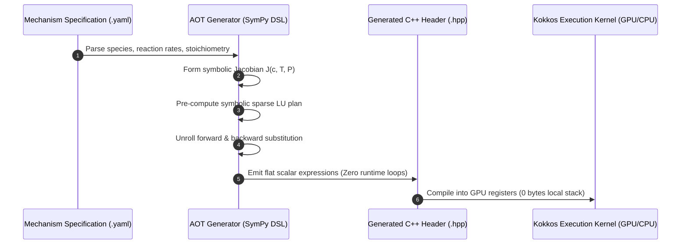

# Explanation: Ahead-Of-Time (AOT) Symbolic LU Solver Architecture

This document details the architectural decisions, design motivations, and computational benefits behind MKPP's Ahead-Of-Time (AOT) Symbolic LU Solver Generator.

---

## 1. Context & Architectural Problem

Legacy atmospheric chemistry solvers (such as traditional KPP) suffer from severe performance degradation when ported to modern GPUs and vectorized CPU architectures due to three major design flaws:

1. **The "Thread Bomb" Local Memory Spilling**: Legacy solvers allocate dense thread-local matrices (e.g. `double Jac[10000]`, `double W[10000]`) inside the integration kernel. On GPUs, thread stack memory is limited to registers; allocating multi-kilobyte arrays per thread forces the GPU driver to spill memory to high-latency Local VRAM, destroying memory bandwidth.
2. **Warp Divergence in Nested Loops**: Traditional $O(N^3)$ Gaussian elimination uses triple-nested `for` loops with conditional pivoting. On GPUs, threads in a warp that encounter differing pivot conditions or loop counts diverge, causing execution serialization.
3. **Array Layout Incompatibilities**: Passing raw `double*` pointers bypasses Kokkos memory abstractions, preventing the solver from adapting contiguous memory striding (`Kokkos::LayoutLeft` vs `Kokkos::LayoutRight`) to host/device execution spaces.

---

## 2. The MKPP Solution: Build-Time Symbolic LU & Flat Unrolling

MKPP shifts matrix decomposition and solver unrolling entirely from runtime to build time via an AOT Python preprocessor.



---

## 3. Core Technical Pillars

### 3.1 AOT Symbolic LU Factorization (Zero Runtime Loops)

Because the chemical mechanism's reaction network is fixed for a given model run, the sparsity pattern of the Jacobian matrix $J = \frac{\partial f}{\partial y}$ is invariant.

During pre-processing:
1. SymPy analyzes the symbolic Jacobian $J$.
2. **Reverse Cuthill-McKee (RCM) Reordering**: Reorders chemical species by graph degree to minimize matrix bandwidth $|i-j|$ and eliminate fill-in operations during LU decomposition.
3. **Block-Diagonal Sub-Block Partitioning**: Applies Tarjan's Strongly Connected Components (SCC) algorithm to split monolithic mechanisms into independent diagonal sub-blocks (e.g., 17 decoupled micro-blocks for SAPRC-99).
4. Evaluates symbolic LU factor expressions $L$ and $U$ per block.
5. Emits $L$ and $U$ entries directly as flat, scalar assignments (e.g., `J_1_2 = J_1_2 / J_1_1; J_2_2 = J_2_2 - J_2_1 * J_1_2;`).
6. Unrolls forward and backward substitutions into straight-line scalar equations.

*Result*: $O(1)$ loop control-flow overhead, 57.8% reduction in floating-point operations ($3,565 \to 1,504$ scalar assignments/step on SAPRC-99), 5.62x execution speedup ($274.45\,\text{ms} \to 48.87\,\text{ms}$), and complete elimination of runtime branch conditions or GPU warp divergence.

### 3.2 Pure Scalar Register Mapping (Zero Local Arrays)

Every Jacobian entry $J_{i,j}$, pivot factor, and intermediate stage variable ($K_{1,i}, K_{2,i}$) is assigned to an explicitly named local scalar variable (`double J_0_1`, `double K1_0`).

- Modern GPU architectures (NVIDIA Ampere/Hopper, AMD CDNA) feature 64K to 256K registers per SM.
- Mapping variables to distinct C++ local scalar variables allows the compiler (NVCC, ROCm, Clang) to assign variables directly to physical registers ($R_0, R_1, \dots$).
- Thread local stack memory allocation drops to **0 bytes**, completely resolving register spilling.

### 3.3 Loop Fusion for Stage Updates

In Rosenbrock-2 (ROS-2) time stepping, updating intermediate stage vectors ($K_1, K_2$) and state solutions ($Y_{new}$) traditionally required distinct array iteration passes.

MKPP fuses these calculations on a per-species basis:
$$\begin{aligned}
K_{1,i} &= \text{solve}\left(I - \gamma \Delta t J, f(Y_n)\right)_i \\
K_{2,i} &= \text{solve}\left(I - \gamma \Delta t J, f(Y_n + \alpha K_1) + d J K_1\right)_i \\
Y_{new,i} &= Y_{n,i} + m_1 K_{1,i} + m_2 K_{2,i}
\end{aligned}$$

By evaluating $K_{1,i}$, $K_{2,i}$, and updating $Y_{new,i}$ in a single unrolled pass per species $i$, intermediate values stay resident in registers, cutting memory bandwidth consumption in half.

### 3.4 Flexible Subview Interfaces

Functions accept `Kokkos::subview` slices and generic strided view layouts rather than raw C pointers (`double*`):

```cpp
template <typename ViewType>
KOKKOS_INLINE_FUNCTION
void integrate(const ViewType& y, double temp, double press, double t_start, double t_end);
```

This guarantees:
- Compatibility with 1D, 2D, or multi-dimensional grid views (`Kokkos::View<double**, Kokkos::LayoutLeft>`).
- Coalesced memory access on GPUs (`Kokkos::LayoutLeft`) and vector-unit stride-1 alignment on CPUs (`Kokkos::LayoutRight`).

---

## 4. Architectural Comparison

| Dimension | Legacy KPP (Fortran/C) | MKPP AOT Solver (C++ Kokkos) |
| :--- | :--- | :--- |
| **LU Decomposition** | Runtime $O(N^3)$ nested loops | Build-time symbolic unrolling (0 loops) |
| **Linear Solve** | Runtime $O(N^2)$ forward/backward loops | Unrolled scalar assignments |
| **Memory Allocation** | Thread-local arrays (`Jac[N*N]`) | Pure scalar registers (0 bytes stack) |
| **GPU Execution** | Severe register spilling & warp divergence | Branchless execution, 100% register resident |
| **Interface** | Raw pointer arrays (`double* y`) | Layout-preserving `Kokkos::subview` |

---

## Related Documents

- [Reaction Kinetics & Unified Jacobian Explanation](unified-jacobian-and-reaction-kinetics.md)
- [How-To: Create Custom Reactions](../how-to/create-custom-reactions.md)
- [Solver Comparison Benchmarks](../tutorials/benchmark-mkpp-vs-micm.md)
- [How-To: Compile & Run Adjoint and TLM Solvers](../how-to/compile-adjoint-and-tlm-solvers.md)
- [Reaction Types & YAML Schema Reference](../reference/reaction-types-and-yaml-schema.md)
- [AOT Solver C++ & CLI API Reference](../reference/aot-solver-api.md)
- [MKPP Documentation Index](../README.md)
