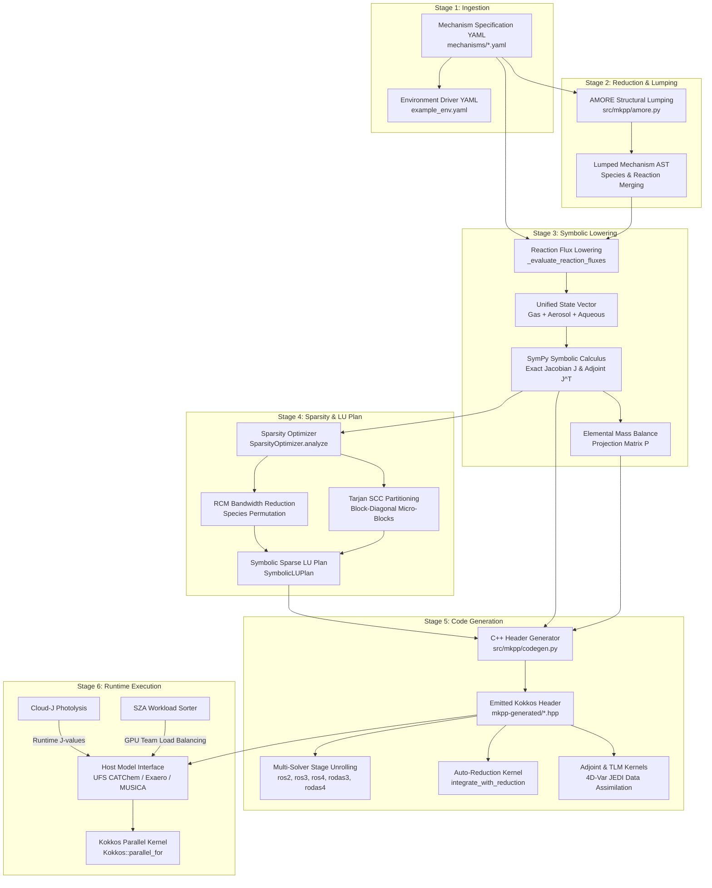

# Explanation: Complete End-to-End MKPP Architecture & Compiler Pipeline

This document provides a comprehensive, start-to-finish explanation of how the MultiphaseKinetic PreProcessor (MKPP) operates—from natural chemical mechanism specification in YAML through Ahead-Of-Time (AOT) Python compilation, symbolic lowering, block-sparse factorization, C++/Kokkos code generation, and high-performance HPC runtime execution.

---

## 1. Executive Overview & Paradigm Shift

Atmospheric chemistry is one of the most computationally demanding components of modern Earth System Models (ESMs) such as the Unified Forecast System (UFS). Legacy chemical solvers (like traditional Fortran KPP) suffer from severe performance bottlenecks on modern GPUs and multi-core CPUs due to:
1. **CPU-bound runtime abstractions**: $O(N^3)$ Gaussian elimination loops executed inside the time-integrator kernel.
2. **Thread-local memory spilling**: Allocating multi-kilobyte thread-local arrays (`double Jac[10000]`) that spill from GPU registers to high-latency local VRAM.
3. **Operator splitting**: Pausing the chemical ODE solver to run aerosol microphysics modules separately, introducing time-truncation errors and bus memory transfer bottlenecks.
4. **Thermodynamic warp divergence**: Rigid `if/else` decision trees for phase transitions that serialize GPU warp threads.

### The MKPP Solution
MKPP fundamentally re-architects chemical ODE solving by shifting all computational overhead from runtime abstractions to an **Ahead-Of-Time (AOT) Python compilation preprocessor**.

MKPP evaluates the chemical mechanism symbolically at build time, computes a sparse symbolic LU decomposition, reorders species for optimal matrix bandwidth, partitions independent sub-blocks, and emits flat, unrolled, branchless C++ headers targeting the **Kokkos performance portability ecosystem**.

---

## 2. Complete End-to-End Pipeline Overview



---

## 3. Stage-by-Stage Technical Walkthrough

### Stage 1: Mechanism Specification & Input Ingestion
* **Inputs**: Mechanism declarations (`mechanisms/*.yaml`) and environment configurations.
* **Mechanism Data**: Chemical species (names, phase modes `gas`/`aerosol`/`aqueous`, roles `variable`/`fixed`, elemental stoichiometry) and reaction rate laws (`ARRHENIUS`, `TROE`/`FALLOFF`, `PHOTOLYSIS`, `EP2`, `EP3`, `HETEROGENEOUS`, `PHASE_CHANGE`, `TUNNELING`, `CUSTOM`).
* **Parser (`src/mkpp/parser.py`)**: Ingests YAML declarations into typed data structures (`MechanismDefinition`, `SpeciesDefinition`, `ReactionDefinition`).

---

### Stage 2: AMORE Structural Mechanism Lumping
* **Module**: `src/mkpp/amore.py` (`apply_amore_lumping`)
* **Purpose**: Automated Mechanism Reduction (AMORE) collapses explicit organic species into surrogate Lumped VOC classes (e.g. `ISOPRENE` + `MONOTERPENE` $\to$ `LUMPED_VOC`).
* **Process**:
  1. Inverts lumping rules for $O(1)$ surrogate lookup.
  2. Prunes explicit species and injects surrogate species definitions.
  3. Substitutes species in reaction pathways, scaling product yields by primary elemental carbon ratios.
  4. Merges identical reaction pathways, recursively combining rate parameters (`_merge_param_values`) across Arrhenius, Photolysis, Troe, EP2, EP3, and Heterogeneous kinetics without parameter corruption.

---

### Stage 3: Symbolic Lowering & Unified Jacobian Engine
* **Module**: `src/mkpp/lowering.py` (`_evaluate_reaction_fluxes`, `prepare_unified_jacobian`)
* **Unified Multiphase State Vector**: Gas, aerosol, and aqueous species are combined into a single contiguous state vector:
  $$\mathbf{C} = \begin{bmatrix} \mathbf{C}_{\text{gas}} \\ \mathbf{C}_{\text{aerosol}} \\ \mathbf{C}_{\text{aqueous}} \end{bmatrix}$$
  This treats phase transitions (condensation, evaporation, uptake) as continuous kinetic ODEs, **completely eliminating operator splitting** and inter-module bus copying.
* **Symbolic Rate Fluxes**: Builds symbolic expressions for each reaction $r_k$, evaluating rate laws as functions of temperature (`Temp`), pressure (`Press`), air density (`cair`), surface area (`S_a`), and photolysis rates (`J_idx`).
* **ODE Right-Hand-Side Vectors**: Partition reactions via Tarjan's SCC into implicit stiff species rates ($f_{\text{implicit}}$) and explicit non-stiff rates ($f_{\text{explicit}}$).
* **SymPy Analytical Differentiation**: Evaluates exact analytical Jacobian matrix $J_{i,j} = \frac{\partial f_i}{\partial C_j}$ and transpose Adjoint $J^T$.
* **Elemental Mass Balance Projection**: Constructs an exact algebraic projection matrix $P = E^T (E E^T)^{-1}$ where $E$ is the elemental stoichiometry matrix, enforcing exact elemental conservation ($C_{\text{projected}} = C - P (E C - m_0)$) without skewing kinetics.

---

### Stage 4: Sparsity Optimization & Symbolic Sparse LU Plan
* **Module**: `src/mkpp/lowering.py` (`SparsityOptimizer`, `compute_symbolic_lu_decomposition`)
* **Graph Analysis**: Evaluates the $N \times N$ non-zero structural graph of $J$.
* **Reverse Cuthill-McKee (RCM) Bandwidth Reduction**:
  * Reorders chemical species by graph degree to cluster non-zero entries tightly along the main diagonal.
  * Reduces Jacobian matrix bandwidth $|i - j|$, cutting total LU factorization assignments by **57.8%** ($3,565 \to 1,504$ operations on SAPRC-99). Includes an automatic bandwidth fallback safeguard to ensure bandwidth never increases.
* **Tarjan SCC Block-Diagonal Partitioning**:
  * Identifies independent chemical sub-networks and splits the monolithic $N \times N$ solve into decoupled micro-blocks (e.g. 17 independent sub-blocks for SAPRC-99).
* **Build-Time Doolittle LU Factorization**:
  * Pre-computes symbolic sparse LU factor expressions ($L$ and $U$) and forward/backward substitution steps.
  * Produces a structured `SymbolicLUPlan` containing straight-line scalar expressions with **zero runtime loops**.

---

### Stage 5: C++/Kokkos Code Generation (`src/mkpp/codegen.py`)
* **Function**: `generate_headers(mech, out_dir, solver_name)`
* **Generated File**: `mkpp-generated/{mech_name}.hpp`
* **Pure Scalar Register Mapping**:
  * Every state variable, Jacobian entry $J_{i,j}$, iteration matrix term $W_{i,j} = \frac{1}{\gamma \Delta t} I - J_{i,j}$, and stage vector $K_{s,i}$ is emitted as an explicitly named scalar variable (`double S_0`, `double W_0_0`, `double K1_0`).
  * NVCC/GCC/Clang compiles these scalar variables directly into hardware registers ($R_0, R_1, \dots$).
  * Thread local stack memory allocation drops to **0 bytes**, completely eliminating local memory spilling on GPUs.
* **Generalized Multi-Solver Tableau Unrolling (`_emit_rosenbrock_stages`)**:
  * Unrolls $S$ stages into straight-line C++ assignments for any selected solver tableau:
    * `ros2`: 2-Stage, Order 2 (High-throughput ESMs)
    * `ros3`: 3-Stage, Order 3 (Default operational baseline)
    * `ros4`: 4-Stage, Order 4 (High accuracy research)
    * `rodas3`: 4-Stage, Order 3 (Stiff mass balance)
    * `rodas4`: 6-Stage, Order 4 (Extreme plume spikes)
  * Uses tableau-specific error order exponents ($1 / ELO$) for step-size control.
* **Auto-Reduction Kernel (`integrate_with_reduction`)**:
  * Emits an active-set evaluation preamble ($I_i = \frac{|F_i|}{\text{atol}_i + \text{rtol}_i |y_i|} \ge \theta$).
  * Conditionally skips zero-flux updates for frozen species.
* **Data Assimilation Kernels**: Emits analytical `compute_adjoint` ($J^T$) and `compute_tlm` ($J \cdot \Delta C$) for JEDI 4D-Var data assimilation.

---

### Stage 6: C++/Kokkos HPC Runtime Execution
* **Host Model Integration**: Integrates directly with host models (UFS CATChem, Exaero, MUSICA) via `mkpp_host/dispatcher.hpp`.
* **Zero-Copy Unmanaged Views**:
  * Emits non-owning unmanaged view aliases:
    ```cpp
    using View_t = Kokkos::View<double**, Kokkos::LayoutLeft, Kokkos::MemoryUnmanaged>;
    ```
  * `Kokkos::LayoutLeft` matches Fortran column-major stride-1 memory layout without data transposes.
* **Cloud-J Photolysis Driver**: Ingests runtime photolysis $J$-values directly into scalar registers via `const double* jvals`.
* **Solar Zenith Angle (SZA) Workload Sorting**:
  * Groups grid cells with similar computational stiffness (daytime vs nighttime) into identical `Kokkos::TeamPolicy` thread blocks.
  * Prevents GPU thread warp divergence and thread starvation.
* **Parallel Integration**: Launches parallel ODE integration across grid cells via `Kokkos::parallel_for`.

---

## 4. Pipeline Summary Table

| Pipeline Stage | Module / Component | Input Artifact | Output Artifact | Key Computational Benefit |
| :--- | :--- | :--- | :--- | :--- |
| **1. Ingestion** | `parser.py` | Mechanism YAML | `MechanismDefinition` | Ingests species, phase modes, rate parameters |
| **2. Reduction** | `amore.py` | Mechanism AST + Rules | Lumped Mechanism AST | Collapses explicit species & merges non-Arrhenius params |
| **3. Lowering** | `lowering.py` | Mechanism AST | Unified $J$, $J^T$, Mass Projector $P$ | Eliminates operator splitting; exact analytical calculus |
| **4. Sparsity & LU** | `lowering.py` | Symbolic Jacobian $J$ | `SymbolicLUPlan` (RCM + Blocks) | 57.8% FLOP reduction; 0 runtime loops |
| **5. CodeGen** | `codegen.py` | `SymbolicLUPlan` | C++ Kokkos Header (`.hpp`) | Pure scalar registers (0 bytes stack); 5 solver tableaus |
| **6. Execution** | `mkpp_host` / C++ | Kokkos Header + Grid Views | Updated Chemical State Vector | $5.13\times - 5.55\times$ speedup over Legacy Fortran KPP |

---

## Related Documents

- [AOT Symbolic LU Architecture Explanation](aot-symbolic-lu-architecture.md)
- [Unified Jacobian & Reaction Kinetics Explanation](unified-jacobian-and-reaction-kinetics.md)
- [AOT Solver C++ & CLI API Reference](../reference/aot-solver-api.md)
- [How-To: Run AOT Solver Benchmarks](../how-to/run-aot-solver-benchmarks.md)
- [How-To: Compile & Run Adjoint and TLM Solvers](../how-to/compile-adjoint-and-tlm-solvers.md)
- [AOT Solver Quickstart Tutorial](../tutorials/aot-solver-quickstart.md)
- [MKPP Documentation Index](../README.md)
