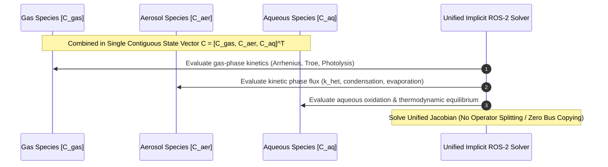

# Explanation: Reaction Kinetics, Multiphase Aerosols, and Unified Jacobian Construction

This document explains the mathematical foundations, reaction rate formulations, multiphase aerosol state vector integration, and SymPy-based Unified Jacobian construction in the Futuristic Kinetic PreProcessor (MKPP/FKPP).

---

## 1. Mathematical Formulations of Reaction Types

MKPP's Ahead-Of-Time (AOT) Python preprocessor symbolically evaluates and differentiates reaction kinetics using SymPy. Each reaction $r_k$ computes a kinetic rate flux $R_k$:

$$R_k = k(T, P, M, \dots) \prod_{j \in \text{reactants}} [C_j]^{s_{j,k}}$$

where $s_{j,k}$ is the stoichiometric coefficient of reactant $j$.

### 1.1 ARRHENIUS
Modified Arrhenius rate laws account for temperature-dependent rate constants:

$$k(T) = A \cdot \left(\frac{T}{300}\right)^B \cdot \exp\left(-\frac{C}{T}\right)$$

- **`A`**: Pre-exponential factor $[\text{cm}^3/\text{molec/s}$ or $1/\text{s}]$.
- **`B`**: Temperature dependence exponent $n$.
- **`C`**: Activation energy parameter $E_a / R$ $[K]$.

### 1.2 TROE / FALLOFF
Pressure-dependent unimolecular and recombination reactions use low-pressure ($k_0$) and high-pressure ($k_\infty$) limits:

$$k_0(T) = A_0 \left(\frac{T}{300}\right)^{B_0} \exp\left(-\frac{C_0}{T}\right) \cdot [M]$$

$$k_\infty(T) = A_\infty \left(\frac{T}{300}\right)^{B_\infty} \exp\left(-\frac{C_\infty}{T}\right)$$

$$P_r = \frac{k_0(T)}{k_\infty(T)}, \quad F = F_c^{\frac{1}{1 + \left(\log_{10} P_r\right)^2}}$$

$$k(T, M) = \left(\frac{k_0(T)}{1 + P_r}\right) \cdot F$$

- **`Fc`**: Falloff broadening factor (default: $0.6$).
- **`[M]`**: Total air density $[\text{molec/cm}^3]$.

### 1.3 PHOTOLYSIS
Photolytic rate laws driven by solar irradiance ($J$-values):

$$R_k = J_{\text{photo}} \cdot \prod_{j} [C_j]^{s_{j,k}}$$

In MKPP, $J_{\text{photo}}$ is evaluated dynamically as a continuous function of Solar Zenith Angle (SZA) or provided by the Cloud-J photolysis module inside thread registers.

### 1.4 EP2 & EP3 (Specialized Termolecular / Multi-Channel Rates)
Specialized reactions with parallel or complex pressure dependencies:

- **EP2**: $k(T) = K_0 + \frac{K_3}{1 + K_3 / K_2}$ where $K_i = A_i \exp(-C_i / T)$.
- **EP3**: $k(T, M) = K_1 + K_2 \cdot [M]$ where $K_i = A_i \exp(-C_i / T)$.

### 1.5 HETEROGENEOUS (Gas-to-Aerosol / Surface Reactions)
Pseudo-first-order uptake of gas species onto aerosol particle surfaces ($N_2O_5$ hydrolysis, $SO_2$ oxidation, $HNO_3$ condensation):

$$k_{\text{het}} = \frac{1}{4} \cdot \gamma \cdot v_{\text{gas}} \cdot S_a$$

- **$\gamma$**: Mass accommodation / uptake coefficient (dimensionless).
- **$v_{\text{gas}}$**: Mean molecular thermal velocity $\sqrt{\frac{8 R T}{\pi M_{\text{w}}}}$ $[m/s]$.
- **$S_a$**: Aerosol surface area density $[m^2/m^3]$.

### 1.6 SPLINE / $C^1$ HERMITE POLYNOMIALS
To avoid GPU thread warp divergence caused by dynamic `if/else` lookup tables (e.g. Volatility Basis Set / VBS secondary organic aerosol yields), MKPP parameterizes complex yield curves using analytically $C^1$ differentiable cubic Hermite polynomials $Y(\text{NO}_x, T, RH)$.

---

## 2. Multiphase Aerosol State Vector Integration

Legacy Earth System Models separate gas-phase kinetics from aerosol microphysics using **operator splitting**. The model pauses the chemical solver, copies concentrations over the bus to an external aerosol module, calculates condensation, and returns the updated state. This causes severe time-truncation errors and memory bandwidth bottlenecks.

### 2.1 The Multiphase State Vector
MKPP eliminates operator splitting by unifying gas, aerosol, and aqueous phase species into a single, contiguous state vector $\mathbf{C}$:

$$\mathbf{C} = \begin{bmatrix} \mathbf{C}_{\text{gas}} \\ \mathbf{C}_{\text{aerosol}} \\ \mathbf{C}_{\text{aqueous}} \end{bmatrix}$$

Phase transitions are formulated as continuous kinetic flux ODEs that directly couple gas-phase loss to aerosol/aqueous-phase production:

$$\frac{d [C_{\text{gas}}]}{dt} = - k_{\text{het}} [C_{\text{gas}}], \quad \frac{d [C_{\text{aerosol}}]}{dt} = + k_{\text{het}} [C_{\text{gas}}]$$

### 2.2 Representation-Agnostic Aerosol Coupling
Domain scientists can select aerosol representations in mechanism YAML declarations without modifying C++ execution logic:

1. **Bulk / Bin**: Phase transfer is represented via multi-bin kinetic flux ODEs ($g_i \leftrightarrow a_{i,b}$).
2. **Modal (e.g., MAM4)**: Mass and particle number are coupled. As gas mass condenses, the median diameter $D_{pg}$ shifts continuously; derivatives accommodating shifting diameters are folded directly into the Jacobian.
3. **Sectional (e.g., SALSA)**: Condensation is coupled with a 1D upwind advection flux across size bin boundaries to prevent trapped mass.

### 2.3 Prognostic Continuous Thermodynamics
Metastable phase states (deliquescence and efflorescence hysteresis) are tracked by treating the aqueous liquid water fraction as a **prognostic state variable**. Differential equations govern phase transitions smoothly without conditional `if/else` branching on GPUs.

---

## 3. Unified Jacobian Construction & Ordering

### 3.1 SymPy Symbolic Calculus Pipeline

For each species $i$, the total time derivative $\frac{d C_i}{dt}$ is assembled by summing all producing and consuming reaction fluxes:

$$\frac{d C_i}{dt} = \sum_{k \in \text{producing}} \nu_{i,k} R_k - \sum_{k \in \text{consuming}} \nu_{i,k} R_k$$

The total ODE function vector $\mathbf{f}_{\text{total}}(\mathbf{C}) = \mathbf{f}_{\text{implicit}}(\mathbf{C}) + \mathbf{f}_{\text{explicit}}(\mathbf{C})$ is differentiated symbolically with respect to the species state vector $\mathbf{C}$:

$$J_{i,j} = \frac{\partial f_i}{\partial C_j}$$

Because SymPy computes exact analytical derivatives, the resulting Jacobian entries $J_{i,j}$ are pre-formed during AOT build time into unrolled, flat scalar assignment statements.

### 3.2 Species Ordering & Tarjan SCC Graph Partitioning

To optimize linear algebra and minimize fill-in during LU decomposition, species are ordered deterministically:

1. **Species Dependency Graph**: A directed graph $G = (V, E)$ is built where edges represent reactant-to-product pathways.
2. **Strongly Connected Components (SCC)**: Tarjan's SCC algorithm partitions species into stiff (implicit) cycles and non-stiff (explicit) feed-forward chains.
3. **Deterministic Ordering**: Stiff species that participate in coupled Jacobian cycles are placed first to maximize diagonal dominance. Fixed species (`AIR`, `O2`, `H2O`) are placed at the end with zero rate fluxes ($\frac{d C_{\text{fix}}}{dt} = 0$).

### 3.3 Iteration Matrix $W$ and Symbolic Sparse LU Factorization

In Rosenbrock time integration, the linear system solved at each stage is:

$$W \cdot K = \mathbf{f}(\mathbf{Y}_n)$$

where $W$ is the iteration matrix:

$$W = \frac{1}{\gamma \Delta t} I - J$$

1. **Diagonal Shift**: The diagonal elements $W_{i,i} = \frac{1}{\gamma \Delta t} - J_{i,i}$ are guaranteed to be non-zero.
2. **Build-Time Doolittle LU Plan**: The AOT generator pre-computes symbolic factorization schedules for $L$ and $U$ factors ($W = L \cdot U$) using Doolittle's algorithm:

$$L_{i,k} = \frac{1}{U_{k,k}} \left( W_{i,k} - \sum_{m=1}^{k-1} L_{i,m} U_{m,k} \right)$$

$$U_{k,j} = W_{k,j} - \sum_{m=1}^{k-1} L_{k,m} U_{m,j}$$

3. **Flat Scalar Code Generation**: Every non-zero entry in $L$ and $U$, as well as forward ($L z = b$) and backward ($U K = z$) substitution, is emitted as a straight-line scalar assignment without runtime loops.

### 3.4 Analytical Adjoint and Tangent-Linear Model (JEDI / 4D-Var)

Because the Jacobian $J$ is derived analytically via SymPy, MKPP automatically derives the transposed analytical Adjoint matrix $J^T$:

$$J^T_{i,j} = J_{j,i} = \frac{\partial f_j}{\partial C_i}$$

This provides out-of-the-box, zero-overhead Adjoint ($\mathbf{\lambda}^{n} = J^T \mathbf{\lambda}^{n+1}$) and Tangent-Linear Model (TLM) kernels for advanced 4D-Var Data Assimilation frameworks (such as JEDI).

---

## Related Documents

- [AOT Symbolic LU Architecture Explanation](aot-symbolic-lu-architecture.md)
- [How-To: Create Custom Reactions](../how-to/create-custom-reactions.md)
- [Reaction Types & YAML Schema Reference](../reference/reaction-types-and-yaml-schema.md)
