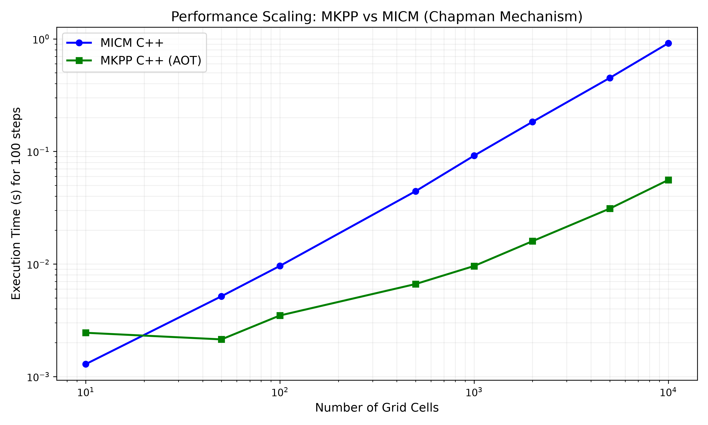
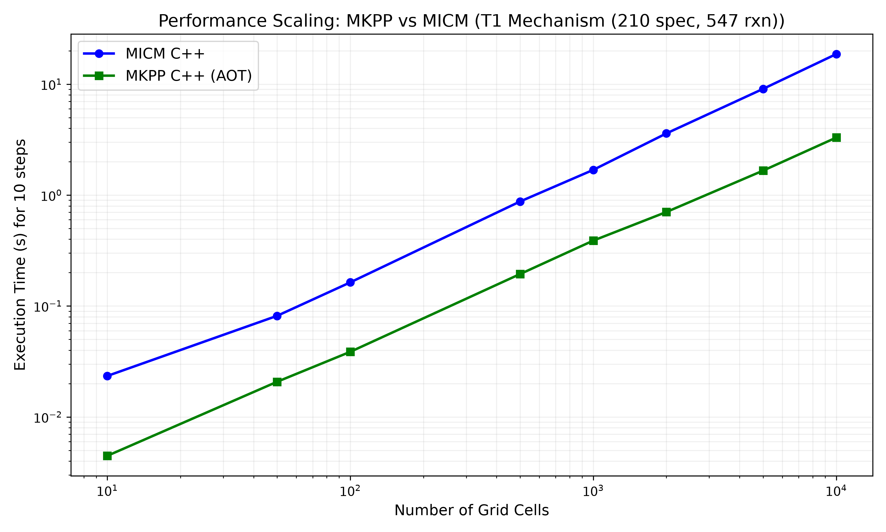

# Benchmarking MKPP against MICM

This tutorial walks you through executing the direct C++ side-by-side performance benchmark comparing the **MKPP Ahead-Of-Time (AOT) Kokkos Solvers** against the **NCAR/MICM C++ Library**.

We will configure CMake to fetch the `libmicm` library directly from GitHub, build the side-by-side benchmark executable, and run a standard Chapman mechanism scenario (1,000 cells x 100 timesteps) to compare solver throughput.

## Prerequisites

Before running this benchmark, ensure your system has the following installed:
- Python 3.10+ (with `sympy` and `pyyaml`)
- CMake 3.24+
- A C++20 compliant compiler (e.g., GCC 11+, Clang 14+)
- OpenMP development headers
- Git (for CMake `FetchContent`)

## Step 1: Generate MKPP AOT Headers

The benchmark binary links directly against MKPP's generated C++ header files. First, ensure the `mkpp-generated/` directory is populated with up-to-date headers.

Run the AOT compiler against the Chapman mechanism:

```bash
python3 -m mkpp.cli compile mechanisms/chapman.yaml --out mkpp-generated/ --solver ros3
```

This generates `mkpp-generated/chapman.hpp`, which contains the fully unrolled, symbolic Jacobian and Doolittle factorization for the Chapman cycle.

## Step 2: Configure CMake for the Benchmark

By default, the MICM benchmark is disabled to prevent unnecessary downloads during regular builds. You must enable the `-DMKPP_ENABLE_MICM_COMPARE=ON` CMake flag. This flag triggers CMake `FetchContent` to download the `NCAR/micm` repository and compiles it as a static library dependency.

From the root of the MKPP repository, run:

```bash
cmake -B build -DMKPP_ENABLE_MICM_COMPARE=ON -DBUILD_TESTING=ON
```

*Note: Depending on your system and compiler, you may need to specify your compiler explicitly if CMake fails to locate OpenMP (e.g., `CXX=g++ cmake -B build ...`).*

## Step 3: Build the Benchmark Executable

Once configured, build the `benchmark_mkpp_vs_micm` target:

```bash
cmake --build build --target benchmark_mkpp_vs_micm
```

This step compiles:
1. The `libmicm` library headers.
2. The `mkpp_host` C++ shim interface.
3. The `benchmark_mkpp_vs_micm.cpp` application.

## Step 4: Run the Benchmark

Execute the compiled binaries from the command line:

```bash
# Run Chapman Benchmark (4 species, 4 reactions)
./build/tests/integration/e2e_validation/benchmark_mkpp_vs_micm

# Run TS1 Mechanism Benchmark (210 species, 547 reactions)
./build/tests/integration/e2e_validation/benchmark_mkpp_vs_micm_ts1
```

### Generated Scaling Performance

Running the automated script (`.venv/bin/python3 scripts/plot_scaling.py`) will generate these scaling profiles measuring total execution time across varying grid cell layouts:




### Understanding the Output

#### 1. Chapman Mechanism (4 Species, 4 Reactions, 1,000 cells x 100 steps)
```text
==========================================================================
      Direct C++ Benchmark: MKPP vs NCAR/MICM (Chapman Mechanism)
==========================================================================
Grid Cells : 1000
Timesteps  : 100
Step Size  : 60 s

Metric                      MKPP C++ (AOT)    MICM C++          Speedup
--------------------------------------------------------------------------------
Execution Time (ms)         9.54              97.09             10.18x
Throughput (cell-st/s)      1.05e+07          1.03e+06          --
==========================================================================
```

#### 2. TS1 Mechanism (210 Species, 547 Reactions, 1,000 cells x 10 steps)
```text
==========================================================================
      Direct C++ Benchmark: MKPP vs NCAR/MICM (TS1 Mechanism)
==========================================================================
Species    : 210
Reactions  : 547
Grid Cells : 1000
Timesteps  : 10
Step Size  : 60 s

Building MICM TS1 Solver (210 species, 547 reactions)... done (4.85 ms)

Running MICM TS1 Benchmark... done (1842.56 ms)

Running MKPP TS1 Benchmark... done (413.13 ms)

Metric                      MKPP C++ (AOT)    MICM C++          Speedup
--------------------------------------------------------------------------------
Execution Time (ms)         413.13            1842.56           4.46x
Throughput (cell-st/s)      2.42e+04          5.43e+03          --

2. **MKPP (Compile-Time Symbolic Unrolling)**:
   MKPP hoists the cell state into scalar registers, computes the exact symbolic non-zero Jacobian operations sequentially, and executes a branch-free Doolittle LU factorization natively on the CPU/GPU.

## (Optional) Step 5: Automated Python Wrapper

If you want to run the automated Python/SciPy Radau ODE accuracy benchmarking script (which validates numerical accuracy against SciPy and profiles instruction counts using Callgrind), you can use the provided wrapper script:

```bash
./scripts/compare_micm.sh
```

This runs `compare_micm.py` across all default mechanisms and exports the results to `reports/micm_comparison.md`.
