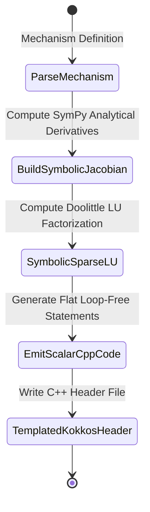

# Data Model: AOT Symbolic LU Kokkos ODE Solver Generator

## Core Entities

### 1. Chemical Mechanism Matrix (`MechanismDefinition` Extension)

Represents the species and reaction rate derivatives for symbolic matrix analysis.

| Attribute | Type | Description |
| :--- | :--- | :--- |
| `name` | `str` | Name of the chemical mechanism (e.g., `saprc99`, `chapman`) |
| `species` | `List[Species]` | Array of species definitions in deterministic index order |
| `reactions` | `List[Reaction]` | Reaction network with stoichiometric coefficients and rate laws |
| `sympy_metadata` | `Dict` | Cache containing `f_vector`, `jacobian_matrix`, `symbolic_lu_plan` |

### 2. Symbolic Sparse LU Plan (`SymbolicLUPlan`)

Build-time structure holding the symbolic decomposition assignments and substitution steps.

| Attribute | Type | Description |
| :--- | :--- | :--- |
| `num_species` | `int` | Matrix dimension $N$ |
| `non_zero_jacobian` | `List[Tuple[int, int, str]]` | List of non-zero Jacobian entry indices $(i, j)$ and symbolic expression strings |
| `l_expressions` | `List[Tuple[int, int, str]]` | Lower triangular matrix entries $L_{i,j}$ expressions |
| `u_expressions` | `List[Tuple[int, int, str]]` | Upper triangular matrix entries $U_{i,j}$ expressions |
| `forward_sub_steps` | `List[Tuple[int, str]]` | Forward substitution scalar steps ($L y = b$) |
| `backward_sub_steps` | `List[Tuple[int, str]]` | Backward substitution scalar steps ($U x = y$) |

### 3. Kokkos Subview Interface (`KokkosSolverInterface`)

C++ template interface definition for solver execution.

| C++ Method / Type | Signature | Description |
| :--- | :--- | :--- |
| `view_1d` | `Kokkos::View<double*, Layout, MemSpace>` | 1D View or Subview type slice representing species state vector |
| `integrate` | `template<class StateView> KOKKOS_INLINE_FUNCTION void integrate(double dt, StateView& state)` | Complete ROS-2 ODE timestep integration |
| `compute_rates` | `template<class StateView, class RateView> KOKKOS_INLINE_FUNCTION void compute_rates(const StateView& state, RateView& rates)` | Evaluates species production/loss rates |
| `compute_jacobian` | `template<class StateView, class JacView> KOKKOS_INLINE_FUNCTION void compute_jacobian(const StateView& state, JacView& J)` | Evaluates non-zero Jacobian elements |

---

## State Transitions & Workflows

