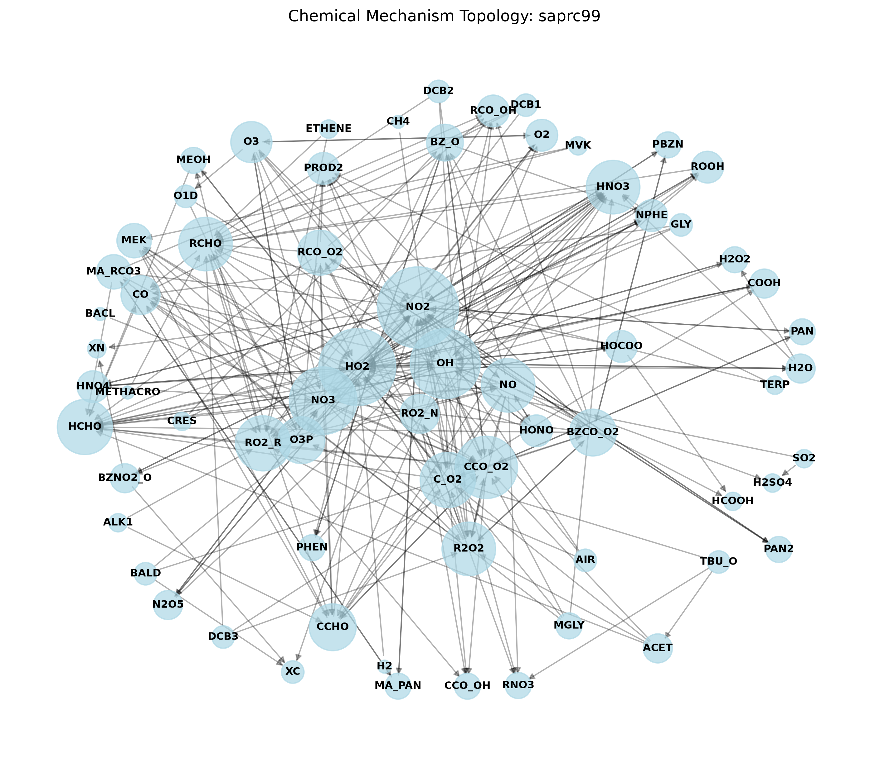

# MKPP Mechanism Diagnostic Report: saprc99

## Overview
- **Total Species**: 80
- **Total Reactions**: 151

### Reaction Types Breakdown
- **PHOTOLYSIS**: 23
- **ARRHENIUS**: 114
- **TROE**: 10
- **EP2**: 1
- **EP3**: 3

### Stiffness Partitioning
- **Implicit (Stiff) Reactions**: 128
- **Explicit (Non-Stiff) Reactions**: 23
- **Graph Topology Status**: Mechanism contains cyclically dependent fast radicals. Tarjan SCC was applied.

## Topology & Graph

## Performance & Stiffness Diagnostics
The following species are the most heavily coupled (densest Jacobian rows). These dictate the performance ceiling of the Dense LU / ROS2 implicit solver block:

| Species | Non-Zero Dependencies |
|---------|-----------------------|
| NO2 | 29 |
| OH | 28 |
| NO3 | 27 |
| HO2 | 25 |
| NO | 19 |

### Warnings
- ⚠️ Mechanism exceeds 50 species. Consider running with `--enable-drgep` to auto-reduce.
- ⚠️ Mechanism contains complex pressure-dependent or empirical falloff rates which expand the AST depth significantly.
