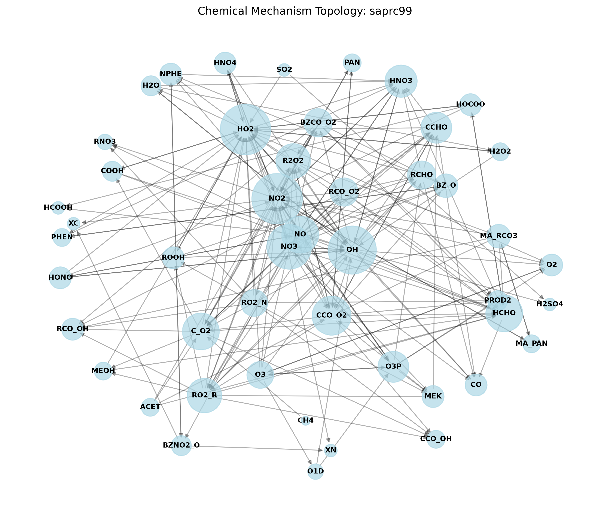

# MKPP Mechanism Diagnostic Report: saprc99

## Overview
- **Total Species**: 49
- **Total Reactions**: 151

### Reaction Types Breakdown
- **PHOTOLYSIS**: 23
- **ARRHENIUS**: 114
- **TROE**: 10
- **EP2**: 1
- **EP3**: 3

### Stiffness Partitioning
- **Implicit (Stiff) Reactions**: 128
- **Explicit (Non-Stiff) Reactions**: 23
- **Graph Topology Status**: Mechanism contains cyclically dependent fast radicals. Tarjan SCC was applied.

## DRGEP Auto-Reduction Summary
- **Species Pruned**: 31
- **Reactions Dropped**: 0

### Pruned Species
The following species were determined to have negligible kinetic impact and were removed: ALK5, OLE2, MVK, H2, ISOPROD, DCB3, ETHENE, AIR, ARO1, DCB2, BACL, TERP, GLY, CCO_OOH, ALK2, BALD, PAN2, ALK1, N2O5, METHACRO, TBU_O, DCB1, M, OLE1, ARO2, MGLY, CRES, ALK3, RCO_OOH, ALK4, PBZN

### Reduced Mechanism Definitions
- Download the reduced species config: [species_saprc99_reduced.yaml](species_saprc99_reduced.yaml)
- Download the reduced reactions config: [reactions_saprc99_reduced.yaml](reactions_saprc99_reduced.yaml)

## Topology & Graph

## Performance & Stiffness Diagnostics
The following species are the most heavily coupled (densest Jacobian rows). These dictate the performance ceiling of the Dense LU / ROS2 implicit solver block:

| Species | Non-Zero Dependencies |
|---------|-----------------------|
| NO2 | 24 |
| HO2 | 24 |
| NO3 | 22 |
| OH | 21 |
| NO | 18 |

### Warnings
- ⚠️ Mechanism contains complex pressure-dependent or empirical falloff rates which expand the AST depth significantly.
